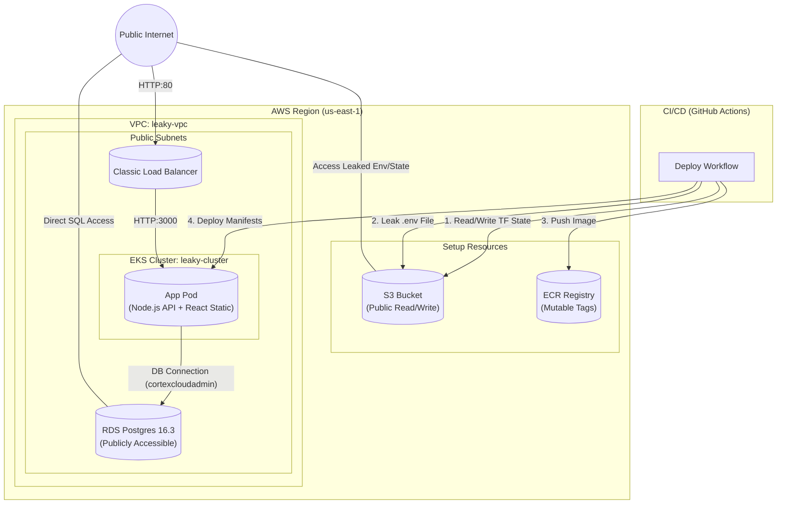
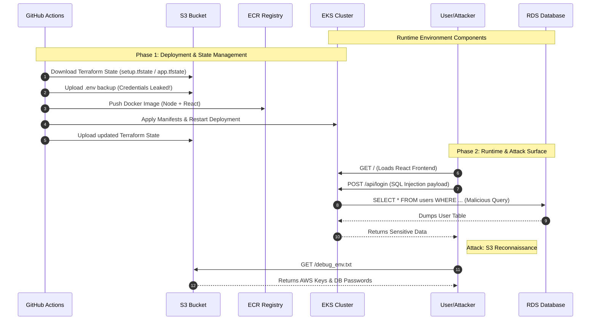

# 🛒 LeakyBucket Shop - CNAPP Training Lab

**WARNING: DO NOT DEPLOY THIS TO A PRODUCTION ACCOUNT.**
This application contains intentional **Critical Severity** vulnerabilities. It is designed for educational purposes, pentesting labs, and demonstrating the value of CNAPP (Cloud Native Application Protection Platform) tools.

## Table of Contents
- [System Architecture](#system-architecture)
- [Deployment Instructions](#deployment-instructions)
- [Attack Scenarios](#attack-scenarios-to-test)

## System Architecture

The application follows a "Shift Left" vulnerability model. The infrastructure is provisioned in two stages (Setup & App), and the runtime uses a single container to serve both the API and the Frontend.

### Architectural Diagram

Red lines indicate direct public access where there should be none.

### Dataflow Diagram
This diagram illustrates how data flows through the application during a user request, highlighting where security controls typically fail in this specific lab.

### Deployment Instructions

#### Prerequisites
* AWS CLI configured (Sandbox account recommended)
* Terraform installed
* Docker installed
* Node.js installed

### 1. Deploy via GitHub Actions Workflow

The entire infrastructure provisioning and application deployment are handled by the `deploy.yml` workflow, triggered manually via `workflow_dispatch`.

1.  **Navigate to Actions:** Go to the "Actions" tab in your GitHub repository.
2.  **Select Workflow:** Click on the "LeakyBucket Infrastructure" workflow in the left sidebar.
3.  **Run Workflow:** Click the "Run workflow" button on the right.
4.  **Choose Action:** Select the action you want to perform:
    * **`apply` (Default):** Provisions/updates the AWS resources (EKS, RDS, S3) and deploys the application code.
    * **`destroy`:** Tears down all the infrastructure (EKS, RDS, etc.) in reverse order.
5.  **Monitor:** Once the job completes, check the "Deploy to EKS" step output or the job summary for the final application URL.

#### 2. Attack Scenarios to Test
* **CNAPP/CSPM:** Detect the `0.0.0.0/0` Security Groups and Public RDS.
* **SCA:** Flag `lodash 4.17.15` in `package.json`.
* **SAST:** Find the `exec(command)` RCE in `server.js`.
* **Secret Scanning:** Find AWS Keys in `infrastructure/main.tf`.
* **Container Security:** Detect `USER root` in `Dockerfile`.
