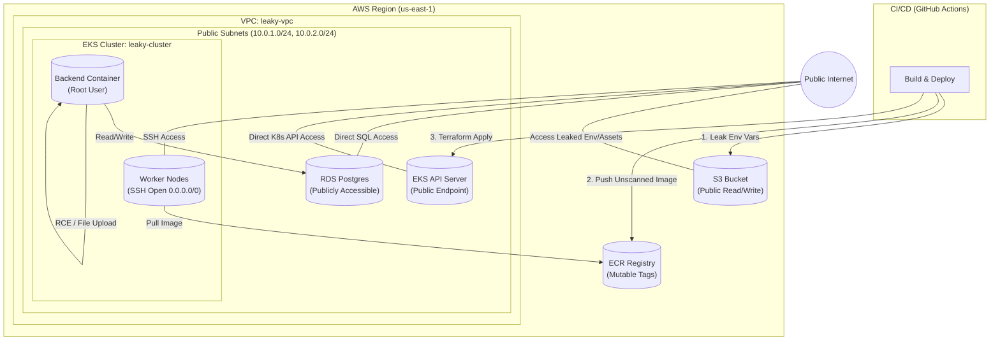
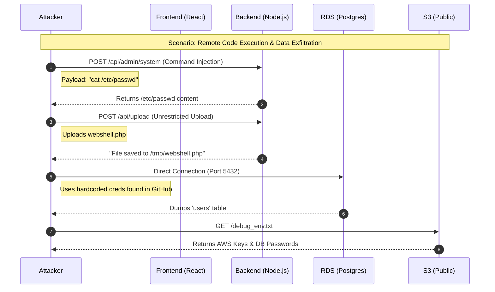

# 🛒 LeakyBucket Shop - CNAPP Training Lab

**WARNING: DO NOT DEPLOY THIS TO A PRODUCTION ACCOUNT.**
This application contains intentional **Critical Severity** vulnerabilities. It is designed for educational purposes, pentesting labs, and demonstrating the value of CNAPP (Cloud Native Application Protection Platform) tools.

## Table of Contents
- [System Architecture](#system-architecture)
- [Deployment Instructions](#deployment-instructions)
- [Attack Scenarios](#attack-scenarios-to-test)

## System Architecture

This application simulates a modern, cloud-native e-commerce platform that has been "shifted left" without security controls.

### Architectural Diagram

Red lines indicate direct public access where there should be none.



### Dataflow Diagram
This diagram illustrates how data flows through the application during a user request, highlighting where security controls typically fail in this specific lab.


### Deployment Instructions

#### Prerequisites
* AWS CLI configured (Sandbox account recommended)
* Terraform installed
* Docker installed
* Node.js installed

#### 1. Provision Infrastructure
The infrastructure is split into logical files but shares a common insecure state.

```bash
cd infrastructure
terraform init
terraform apply -auto-approve
```

#### 2. Build & Deploy Application
(In a real scenario, the GitHub Action handles this, but you can run locally to simulate the build process)

```bash
cd backend
npm install
# Note: This Dockerfile runs as Root
docker build -t leaky-bucket-app .
```

#### 3. Attack Scenarios to Test
* **CNAPP/CSPM:** Detect the `0.0.0.0/0` Security Groups and Public RDS.
* **SCA:** Flag `lodash 4.17.15` in `package.json`.
* **SAST:** Find the `exec(command)` RCE in `server.js`.
* **Secret Scanning:** Find AWS Keys in `infrastructure/main.tf`.
* **Container Security:** Detect `USER root` in `Dockerfile`.
